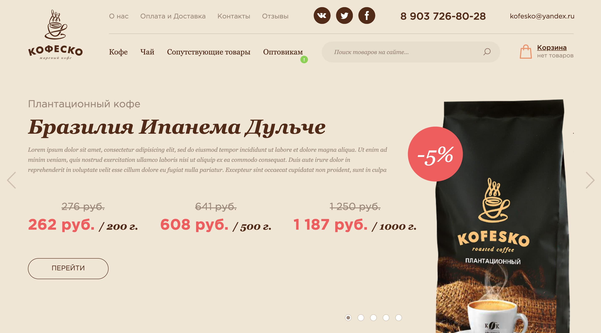

Название сайта: **Кофеско** [![Build status][travis-image]][travis-url] [![Dependency status][dependency-image]][dependency-url]

------------

Главная страница сайта: 🖥️ https://ioinitid.github.io/kofesko-v2/index.html

Страница о нас: 🖥️ https://ioinitid.github.io/kofesko-v2/about.html

Страница контакты: 🖥️ https://ioinitid.github.io/kofesko-v2/contacts.html

Страница доставка: 🖥️ https://ioinitid.github.io/kofesko-v2/delivery.html

Страница отзывы: 🖥️ https://ioinitid.github.io/kofesko-v2/reviews.html

Страница преимущества: 🖥️ https://ioinitid.github.io/kofesko-v2/wholesalers.html

------------

**Превью сайта:**

------------

------------

Сделано с ❤️ в [WEB-ELITIT.RU](https://www.web-elitit.ru "Web-elitit.ru")
> Дизайн сайта: **WEB-ELITIT.RU: ООО "Кофеско"*

------------

**Папка с исходными файлами — `source/`.**

- [contributing.md](contributing.md) — руководство по сборке проекта.

------------

[travis-image]: https://travis-ci.com/htmlacademy-adaptive/1076505-cat-energy-18.svg?branch=master
[travis-url]: https://travis-ci.com/htmlacademy-adaptive/1076505-cat-energy-18
[dependency-image]: https://david-dm.org/htmlacademy-adaptive/1076505-cat-energy-18/dev-status.svg?style=flat-square
[dependency-url]: https://david-dm.org/htmlacademy-adaptive/1076505-cat-energy-18?type=dev
